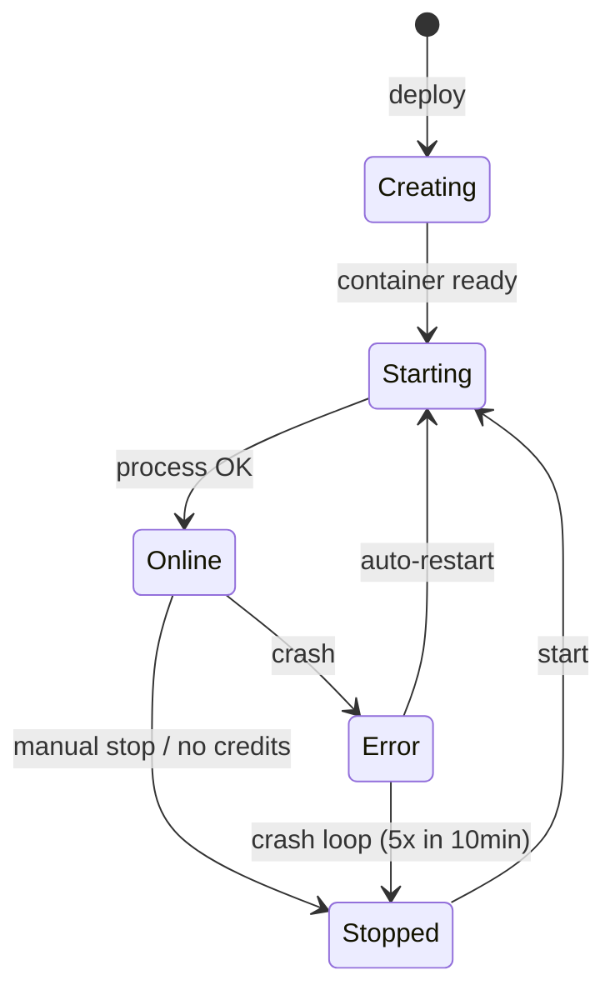

## What are Applications?

Applications on Vertra Cloud run your code in an isolated and secure environment. Each application receives dedicated memory and storage resources, an exclusive subdomain and HTTPS access.

## Application Types

<Tabs>
  <Tab title="Website">
    Web applications accessible via HTTP/HTTPS. They receive an automatic subdomain and can have a custom domain.

    Examples: REST APIs, Next.js applications, dynamic sites, dashboards.
  </Tab>
  <Tab title="Bot">
    Applications that run in background without exposing HTTP port. Ideal for Discord bots, automation scripts and workers.

    Examples: Discord bots, Telegram bots, cron jobs, queue workers.
  </Tab>
</Tabs>

## Supported Languages

The platform supports deploying applications in various languages. The runtime environment is configured automatically based on the selected language.

<CardGroup cols={3}>
  <Card title="JavaScript" icon="js">
    Node.js 18, 20, 22 with npm/yarn
  </Card>
  <Card title="TypeScript" icon="js">
    Node.js 18, 20, 22 via ts-node
  </Card>
  <Card title="Python" icon="python">
    3.10, 3.11, 3.12 with pip
  </Card>
  <Card title="Go" icon="golang">
    1.21+ with go mod
  </Card>
  <Card title="Rust" icon="rust">
    Latest version with cargo
  </Card>
  <Card title="Java" icon="java">
    17, 21 with maven/gradle
  </Card>
  <Card title="PHP" icon="php">
    8.x with composer
  </Card>
  <Card title="Ruby" icon="gem">
    3.x with bundler
  </Card>
  <Card title="Bun" icon="bolt">
    Latest version
  </Card>
  <Card title="Static" icon="file-code">
    HTML, CSS, pure JS
  </Card>
</CardGroup>

<Info>
  Available versions are loaded dynamically via API. Use `recommended` for stable LTS version or `latest` for the newest.
</Info>

## Lifecycle



An application goes through the following states:

| State | Description | Icon |
|-------|-----------|:-----:|
| **Creating** | Container being provisioned and image being built | ↻ |
| **Starting** | Container created, startup process running | ... |
| **Online** | Application running and accessible | ● |
| **Stopped** | Manually stopped or out of credits | ○ |
| **Error** | Container encountered error during execution | ! |

## Configuration File

The `vertracloud.config` file allows you to define application settings directly in the source code. It is read during deployment and applies settings automatically.

```ini
MAIN=index.js
START=npm start
SUBDOMAIN=my-app
VERSION=22
PORT=80
```

| Field | Description | Required |
|-------|-----------|:-----------:|
| `MAIN` | Application's main file | No |
| `START` | Custom startup command | No |
| `SUBDOMAIN` | Desired subdomain | No |
| `VERSION` | Runtime version | No |
| `PORT` | Port exposed by application | No |
| `HOST` | Bind host (default: 0.0.0.0) | No |

## File Manager

The panel includes an integrated file manager with syntax highlighting and code editing that allows:

<AccordionGroup>
  <Accordion title="Navigation and editing" icon="folder-open">
    - File tree with up to 6 levels of depth
    - Syntax highlighting for all supported languages
    - Create, edit, move and delete files and folders
  </Accordion>
  <Accordion title="File upload" icon="upload">
    - Drag-and-drop of individual files or ZIP
    - Automatic file and directory validation
    - Automatic ZIP file extraction
    - Upload blocking for `vertracloud.config` file
  </Accordion>
</AccordionGroup>

<Note>
  Directories like `node_modules`, `.git`, `__pycache__`, `vendor`, `.venv` and `.next` are automatically hidden in the file manager.
</Note>

## Environment Variables

Environment variables are injected into the container at startup and become available as system variables. Manage via dashboard or API.

<Tabs>
  <Tab title="Via Dashboard">
    Access the application → **Environment Variables** → Add, edit or remove variables.
  </Tab>
  <Tab title="Via API">
    ```bash
    # List variables
    curl -H "Authorization: Bearer TOKEN" \
         https://api.vertracloud.app/v1/apps/{id}/envs

    # Update variables
    curl -X POST -H "Authorization: Bearer TOKEN" \
         -H "Content-Type: application/json" \
         -d '[{"key":"DATABASE_URL","value":"..."}]' \
         https://api.vertracloud.app/v1/apps/{id}/envs
    ```
  </Tab>
</Tabs>

## Snapshots

Snapshots are copies of your application's state at a specific moment. Allows you to create manual snapshots, restore previous snapshots and download the content of any snapshot.

<Warning>
  Snapshot restoration has a cooldown period between operations to prevent excessive resource usage.
</Warning>

## Custom Domain

Each Website type application receives a default subdomain (ex: `my-app.vertracloud.app`). You can also connect your own domain with automatic SSL.

<Steps>
  <Step title="Add Domain">
    Configure the custom domain in the application's network settings.
  </Step>
  <Step title="Configure DNS">
    Point the DNS records as indicated in the panel. The platform provides the necessary records (CNAME).
  </Step>
  <Step title="Verification and SSL">
    The platform verifies the DNS configuration and provisions the SSL certificate automatically.
  </Step>
</Steps>

<Note>
  Custom domains are available starting from the **Intermediary** plan.
</Note>

## Auto-Restart and Crash Detection

The platform includes an intelligent auto-restart system with crash loop detection:

<AccordionGroup>
  <Accordion title="How Auto-Restart Works" icon="rotate">
    - Containers that exit unexpectedly are restarted automatically
    - Normal exit codes (0) and syntax/dependency errors **do not** trigger restart
    - A 1-hour cooldown is applied between consecutive restarts
    - The container must be online for at least 60 seconds to count as stable
  </Accordion>
  <Accordion title="Crash Loop Detection" icon="shield">
    - If a container crashes **5 times in 10 minutes**, auto-restart is disabled for 24 hours
    - The system records the reason for the auto-restart shutdown
    - You can manually re-enable auto-restart in settings
  </Accordion>
</AccordionGroup>

## Real-Time Logs

The integrated terminal offers log streaming with:

- ANSI colors preserved
- Timestamps per line
- Automatic level detection (error, warn, info)
- Copy logs with one click
- Fallback to historical logs when application is stopped
- Automatic connection management

## Metrics

The panel displays real-time performance metrics:

<CardGroup cols={3}>
  <Card title="CPU" icon="microchip">
    Container CPU usage percentage in real-time.
  </Card>
  <Card title="Memory" icon="memory">
    Current RAM consumption vs. allocated limit.
  </Card>
  <Card title="Network" icon="network-wired">
    Bytes received and sent with total accumulated.
  </Card>
</CardGroup>
