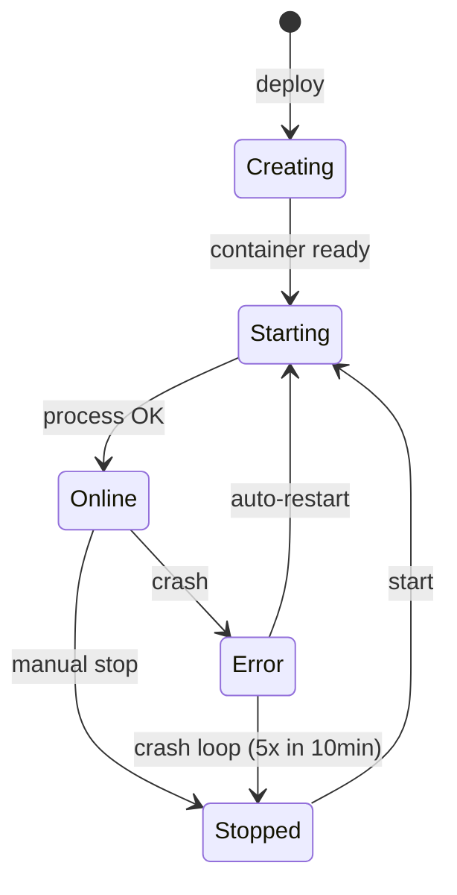

## What is an application on Vertra Cloud?

An application on Vertra Cloud is your code running in its own isolated container, with dedicated
memory and storage and — when published on the web — an exclusive `*.vertraweb.app` subdomain over
HTTPS. Vertra Cloud is a Brazilian application hosting platform (PaaS), and the application is the
unit it deploys, restarts, snapshots and bills through your plan's RAM.

## What types of application are there?

Two: **website**, which listens on an HTTP port and gets a subdomain, and **bot**, a background
process with no exposed port. The type is not fixed at creation — publishing or unpublishing an
application switches it.

<Tabs>
  <Tab title="Website">
    Web applications accessible via HTTP/HTTPS. They receive a subdomain and can have a custom domain.

    Examples: REST APIs, Next.js applications, dynamic sites, dashboards.
  </Tab>
  <Tab title="Bot">
    Applications that run in background without exposing HTTP port. Ideal for Discord bots, automation scripts and workers.

    Examples: Discord bots, Telegram bots, cron jobs, queue workers.
  </Tab>
</Tabs>

The type is not permanent. An application created without web publishing can be published later, and
a published one can be turned back into a private application, from the application's **Network**
settings or through
[Publish Application on the Web](/api-reference/endpoint/apps/network/publish).

<Warning>
  Turning publishing on or off **recreates the container, so the application restarts**. And
  unpublishing **releases the subdomain** — it is not reserved for you, so someone else can take it.
</Warning>

## Supported Languages

The platform supports deploying applications in various languages. The runtime environment is configured automatically based on the selected language.

<CardGroup cols={3}>
  <Card title="JavaScript" icon="js">
    Node.js 20, 22, 24 with npm/yarn
  </Card>
  <Card title="TypeScript" icon="js">
    Node.js 18, 20, 22 via ts-node
  </Card>
  <Card title="Python" icon="python">
    3.11, 3.12, 3.13 with pip
  </Card>
  <Card title="Go" icon="golang">
    1.21, 1.22, 1.23 with go mod
  </Card>
  <Card title="Rust" icon="rust">
    1.85–1.87 with cargo
  </Card>
  <Card title="Java" icon="java">
    17, 21 with maven/gradle
  </Card>
  <Card title="PHP" icon="php">
    8.2, 8.3 with composer
  </Card>
  <Card title="Ruby" icon="gem">
    3.2–3.4 with bundler
  </Card>
  <Card title="Bun" icon="bolt">
    1.1.0, 1.2.2
  </Card>
  <Card title="Static" icon="file-code">
    HTML, CSS, pure JS
  </Card>
</CardGroup>

<Info>
  Available versions come from [List Runtimes](/api-reference/endpoint/apps/runtimes). Use `recommended` for the
  stable version, `latest` for the newest, or pin one of the listed versions by number. A version that
  doesn't exist for the application's language is refused with `INVALID_VERSION`.
</Info>

## Lifecycle


```mermaid
stateDiagram-v2
    [*] --> Creating: deploy
    Creating --> Starting: container ready
    Starting --> Online: process OK
    Online --> Stopped: manual stop
    Online --> Error: crash
    Error --> Starting: auto-restart
    Stopped --> Starting: start
    Error --> Stopped: crash loop (5x in 10min)
```

An application goes through the following states:

| State | Description | Icon |
|-------|-----------|:-----:|
| **Creating** | Container being provisioned and image being built | ↻ |
| **Starting** | Container created, startup process running | ... |
| **Online** | Application running and accessible | ● |
| **Stopped** | Manually stopped | ○ |
| **Error** | Container encountered error during execution | ! |

## Build Command

An optional `build_command` field, available on every plan, runs after dependency installation
and before the application starts — on every deploy that installs or changes code: creation, ZIP
upload, GitHub deploy, dependency reinstall, or a change to the command itself. A plain restart
skips it when the previous build already succeeded with the same command.

The build runs in an isolated build environment: 2× the application's RAM (min 1,024 MB, max
4,096 MB), 2× its vCPU (min 1, max 2), with a 10-minute timeout. A failing command fails the
deploy (`BUILD_FAILED`); running past the timeout does too (`BUILD_TIMEOUT`).

| Framework | Build | Start |
|---|---|---|
| Next.js | `npm run build` | `npx next start -p 80` |
| Nuxt | `npm run build` | `PORT=80 node .output/server/index.mjs` |
| SvelteKit (adapter-node) | `npm run build` | `PORT=80 node build` |
| Remix | `npm run build` | `npx remix-serve build/server/index.js` |
| React Router v7 | `npm run build` | `npx react-router-serve ./build/server/index.js` |
| Astro | `npm run build` | `npx astro preview --host 0.0.0.0 --port 80` |
| Gatsby | `npm run build` | `npx gatsby serve --host 0.0.0.0 -p 80` |
| Vite | `npm run build` | `npx vite preview --host 0.0.0.0 --port 80` |

Applications must listen on **port 80**. When creating an application from a ZIP in the dashboard,
the platform suggests the build and start commands above from the dependencies declared in
`package.json` (Next.js, Nuxt, SvelteKit, Remix, React Router, Astro, Gatsby and Vite) — you can
edit both before creating.

## Configuration File

An optional `vertracloud.config` file (`KEY=value`, one per line) at the root of the uploaded ZIP
pre-fills the creation flow: `NAME`, `DESCRIPTION`, `MAIN`, `MEMORY`, `BUILD`, `START` and
`SUBDOMAIN`. The actual configuration lives in the dashboard (**Config** tab). The file is not
stored in the application volume; it is generated from your current settings when you download the
project or create a snapshot. Every key, its limits and what can change later are in
[Configuration](/configuration).

## File Manager

The panel includes an integrated file manager with syntax highlighting and code editing that allows:

<AccordionGroup>
  <Accordion title="Navigation and editing" icon="folder-open">
    - File tree with up to 6 levels of depth
    - Syntax highlighting for all supported languages
    - Create, edit, move and delete files and folders
  </Accordion>
  <Accordion title="File upload" icon="upload">
    - Drag-and-drop of individual files or ZIP
    - Automatic file and directory validation
    - Automatic ZIP file extraction
  </Accordion>
</AccordionGroup>

## Environment Variables

Environment variables are injected into the container at startup and become available as system variables. Manage via dashboard or API.

<Tabs>
  <Tab title="Via Dashboard">
    Access the application → **Environment Variables** → Add, edit or remove variables.
  </Tab>
  <Tab title="Via API">
    ```bash
    curl -H "Authorization: Bearer TOKEN" \
         https://api.vertracloud.app/v1/apps/{id}/envs

    curl -X POST -H "Authorization: Bearer TOKEN" \
         -H "Content-Type: application/json" \
         -d '[{"key":"DATABASE_URL","value":"..."}]' \
         https://api.vertracloud.app/v1/apps/{id}/envs
    ```
  </Tab>
</Tabs>

## Snapshots

Snapshots are copies of your application's state at a specific moment. Allows you to create manual snapshots, restore previous snapshots and download the content of any snapshot.

<Warning>
  Snapshot restoration has a cooldown period between operations to prevent excessive resource usage.
</Warning>

## Custom Domain

Each published application receives a default subdomain (ex: `my-app.vertraweb.app`). You can also connect your own domain with automatic SSL. Unpublishing the application detaches the custom domain along with the subdomain.

<Steps>
  <Step title="Add Domain">
    Configure the custom domain in the application's network settings.
  </Step>
  <Step title="Configure DNS">
    Point the DNS records as indicated in the panel. The platform provides the necessary records (CNAME).
  </Step>
  <Step title="Verification and SSL">
    The platform verifies the DNS configuration and provisions the SSL certificate automatically.
  </Step>
</Steps>

<Note>
  Custom domains are available starting from the **Intermediary** plan.
</Note>

## Auto-Restart and Crash Detection

Auto-restart is **on by default for every plan**, including Free — there's no toggle and nothing to configure:

<AccordionGroup>
  <Accordion title="How Auto-Restart Works" icon="rotate">
    - Containers that exit unexpectedly are restarted automatically
    - Normal exit codes (0) and syntax/dependency errors **do not** trigger restart
    - A 1-hour cooldown is applied between consecutive restarts
    - The container must be online for at least 60 seconds to count as stable
  </Accordion>
  <Accordion title="Crash Loop Detection" icon="shield">
    - If a container crashes **5 times in 10 minutes**, auto-restart is disabled for 24 hours
    - The system records the reason for the auto-restart shutdown
    - After 24 hours, auto-restart resumes automatically
  </Accordion>
</AccordionGroup>

## Real-Time Logs

The dashboard terminal shows the application's output live; when the application is stopped, it
shows the latest logs. From outside the dashboard, use `vertra logs -f` in the [CLI](/cli) or
[Application Logs](/api-reference/endpoint/apps/logs).

## Metrics

The panel displays real-time performance metrics:

<CardGroup cols={3}>
  <Card title="CPU" icon="microchip">
    Container CPU usage percentage in real-time.
  </Card>
  <Card title="Memory" icon="memory">
    Current RAM consumption vs. allocated limit.
  </Card>
  <Card title="Network" icon="network-wired">
    Bytes received and sent with total accumulated.
  </Card>
</CardGroup>
