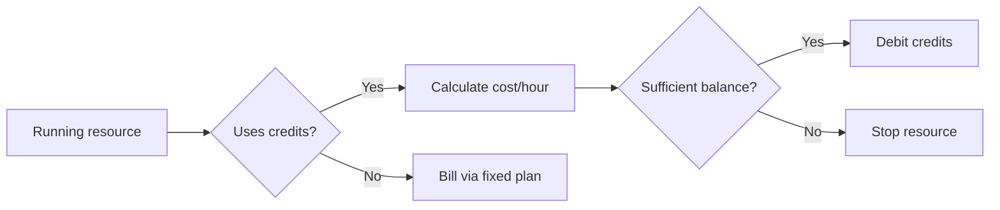

## How It Works

Vertra Cloud's credit system offers a flexible billing model. Use free credits from your plan or purchase additional credits to expand your resources.

<CardGroup cols={2}>
  <Card title="Compute Credits" icon="microchip">
    Used to keep applications and databases running. Automatically debited per hour of use.
  </Card>
  <Card title="AI Credits" icon="brain">
    Reserved for artificial intelligence features on the platform.
  </Card>
</CardGroup>

## Allocation per Plan

Each plan includes a weekly allocation of free credits that is automatically reset every Monday at 00:00 UTC.

<Tabs>
  <Tab title="Compute Credits">
    - Weekly allocation proportional to the plan (e.g., 500/week for Free)
    - Automatic reset every Monday at 00:00 UTC
    - Unused credits **do not** accumulate between cycles
    - Paid credits expire after 365 days
    - *Free Plan note: You can deploy up to 1 app and 1 database using credits.*
  </Tab>
  <Tab title="AI Credits">
    - Separate pool from compute credits
    - Weekly free allocation according to the plan
    - Paid AI credits also expire after 365 days
  </Tab>
</Tabs>

<Note>
  Paid credits (acquired via purchase) expire after **365 days** from the acquisition date.
</Note>

## Hourly Billing

Billing is done automatically every hour. The system checks all running resources that use the credits mode and debits the corresponding amount.



The cost is calculated based on allocated memory and your plan:

| Plan | Rate |
|------|------|
| Free | **10 credits** per 100MB per hour |
| Paid plans | **7 credits** per 100MB per hour |

### When credits run out

When the balance reaches zero, all resources that depend on credits are **automatically stopped**. Options to reactivate:

- Purchase additional credits via dashboard
- Wait for the weekly reset of free credits (every Monday)
- Migrate the resource to fixed plan mode

## Memory Limits per Resource (Credits Mode)

When using credits mode, each individual app or database has a maximum memory limit:

| Plan | Max Memory per Resource |
|------|:----------------------:|
| Free | 1,024 MB (1 GB) |
| Paid Plans | 16,384 MB (16 GB) |

<Note>
  Free plan users can create up to 1 app and 1 database using credits mode, with up to 1 GB of RAM per resource.
  Paid plan users can allocate up to 16 GB of RAM per resource in credits mode.
</Note>

## Cost Estimation

Before creating a resource in credits mode, the dashboard displays an estimate based on selected memory and your plan.

**Formula:** `ceil(RAM_MB / 100) × rate` credits per hour

- **Free plan:** 10 credits per 100MB/hr
- **Paid plans:** 7 credits per 100MB/hr

<Tabs>
  <Tab title="Paid Plans (7 cr/100MB/hr)">
    | Memory | Cost/Hour | Cost/Day | Cost/Month |
    |--------|-----------|----------|------------|
    | 100 MB | 7 credits | 168 credits | 5,040 credits |
    | 256 MB | 18 credits | 432 credits | 12,960 credits |
    | 512 MB | 36 credits | 864 credits | 25,920 credits |
    | 1024 MB | 72 credits | 1,728 credits | 51,840 credits |
  </Tab>
  <Tab title="Free Plan (10 cr/100MB/hr)">
    | Memory | Cost/Hour | Cost/Day | Cost/Month |
    |--------|-----------|----------|------------|
    | 100 MB | 10 credits | 240 credits | 7,200 credits |
    | 256 MB | 26 credits | 624 credits | 18,720 credits |
    | 512 MB | 52 credits | 1,248 credits | 37,440 credits |
    | 1024 MB | 103 credits | 2,472 credits | 74,160 credits |
  </Tab>
</Tabs>

<Info>
  Use the `GET /v1/credits/cost?ram={mb}` endpoint to calculate the exact cost via API.
</Info>

## Credits vs. Fixed Plan

When creating an application or database, choose between two billing modes:

<Tabs>
  <Tab title="Fixed Plan">
    - Monthly billing with fixed value
    - Resources limited by contracted plan
    - Ideal for applications **always online**
    - No automatic stop due to lack of credits
  </Tab>
  <Tab title="Credits">
    - Per-hour billing of actual use
    - Flexible resources (pay only for what you use)
    - Ideal for **intermittent projects** and testing
    - Automatic stop when credits run out
  </Tab>
</Tabs>

## Check Balance and History

<Tabs>
  <Tab title="Via Dashboard">
    Access **Dashboard → Billing** to see:
    - Current balance (free + paid)
    - Usage history with filters by resource type and credit type
    - Transactions and orders with status
    - Available PIX balance
  </Tab>
  <Tab title="Via API">
    ```bash
    # Current balance
    curl -H "Authorization: Bearer TOKEN" \
         https://api.vertracloud.app/v1/credits/balance

    # Usage history
    curl -H "Authorization: Bearer TOKEN" \
         https://api.vertracloud.app/v1/credits/usage

    # Cost estimation
    curl "https://api.vertracloud.app/v1/credits/cost?ram=512"
    ```
  </Tab>
</Tabs>
