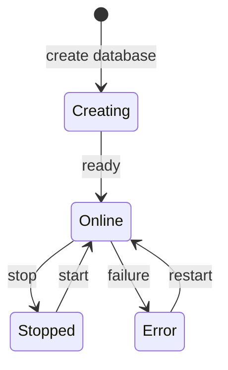

## What is a managed database on Vertra Cloud?

A managed database on Vertra Cloud is a PostgreSQL, MongoDB, Redis or MySQL instance that the
platform provisions, secures and monitors for you: TLS is mandatory, the CA, server and client
certificates are generated automatically, and each database runs in its own container with
dedicated memory and storage.

## Which database engines are available?

Four: PostgreSQL 17, MongoDB 8.0.11, Redis 7 and MySQL 8.0. Every engine requires TLS **and a client
certificate** — a password alone never connects.

<CardGroup cols={2}>
  <Card title="PostgreSQL 17" icon="elephant">
    Relational database with full SQL, JSONB and extensions support.

    **User**: `postgres` &nbsp;|&nbsp; **Database**: `postgres` &nbsp;|&nbsp; **Auth**: password + client certificate
  </Card>
  <Card title="MongoDB 8.0" icon="leaf">
    NoSQL document-oriented database for flexible data.

    **User**: `default` &nbsp;|&nbsp; **Auth database**: `admin` &nbsp;|&nbsp; **Auth**: password + client certificate
  </Card>
  <Card title="Redis 7" icon="bolt">
    In-memory storage for high-performance caching, queues and pub/sub.

    **User**: `default` &nbsp;|&nbsp; **Auth**: password + client certificate
  </Card>
  <Card title="MySQL 8.0" icon="database">
    Popular relational database with ACID transactions and large ecosystem.

    **User**: `root` &nbsp;|&nbsp; **Database**: `default` &nbsp;|&nbsp; **Auth**: password + X509 client certificate
  </Card>
</CardGroup>

## What do I need to connect?

Four things, all on the database page in the dashboard (or through the API):

- **Host** — `<database-id-without-hyphens>.db.usa1.vertraweb.app`, shown on the database page and in
  [Get Database](/api-reference/endpoint/databases/get).
- **Port** — **unique per database**, not the engine's default (5432, 27017, 6379, 3306). Always
  copy it from the database page or the API response.
- **Password** — shown on the database page; [reset it](/api-reference/endpoint/databases/credentials/resetpassword) if needed.
- **Certificates** — download them in the database's **Certificates** tab or through
  [Get Database Certificate](/api-reference/endpoint/databases/credentials/get):

| File | What it is | Use it as |
|---|---|---|
| `certificate-<id>.crt` | Your client certificate | client certificate (`cert`, `sslcert`, `--cert`) |
| `certificate-<id>.key` | Your client private key | client key (`key`, `sslkey`, `--key`) |
| `certificate-<id>.pem` | Bundle: client key + client certificate + the CA that signs the server | CA file (`ca`, `sslrootcert`, `--cacert`) and, for MongoDB, the certificate-key file |

The server certificate matches the database host, so full verification (`verify-full`,
`VERIFY_IDENTITY`, `rejectUnauthorized: true`) works. Keep the `.key` and `.pem` files private — they
authenticate as you. [Resetting the certificates](/api-reference/endpoint/databases/credentials/reset)
issues new ones and invalidates the old files.

## How do I connect to each engine?

In the examples, `<host>`, `<port>` and `<password>` come from the database page, and
`certificate.crt` / `certificate.key` / `certificate.pem` are the three downloaded files.

<Tabs>
  <Tab title="PostgreSQL">
    ```javascript Node.js (pg)
    const { Pool } = require('pg');
    const fs = require('fs');

    const pool = new Pool({
      host: '<host>',
      port: <port>,
      user: 'postgres',
      password: '<password>',
      database: 'postgres',
      ssl: {
        ca: fs.readFileSync('certificate.pem'),
        cert: fs.readFileSync('certificate.crt'),
        key: fs.readFileSync('certificate.key'),
        rejectUnauthorized: true,
      },
    });
    ```

    ```python Python (psycopg)
    import psycopg

    conn = psycopg.connect(
        host="<host>", port=<port>, user="postgres", password="<password>", dbname="postgres",
        sslmode="verify-full", sslrootcert="certificate.pem",
        sslcert="certificate.crt", sslkey="certificate.key",
    )
    ```

    ```bash psql
    psql "host=<host> port=<port> dbname=postgres user=postgres password=<password> sslmode=verify-full sslrootcert=certificate.pem sslcert=certificate.crt sslkey=certificate.key"
    ```
  </Tab>
  <Tab title="MongoDB">
    The user lives in the `admin` database, so the URI always needs `authSource=admin`.

    ```javascript Node.js (mongodb)
    const { MongoClient } = require('mongodb');

    const client = new MongoClient('mongodb://default:<password>@<host>:<port>/?authSource=admin', {
      tls: true,
      tlsCAFile: 'certificate.pem',
      tlsCertificateKeyFile: 'certificate.pem',
    });
    ```

    ```bash mongosh
    mongosh "mongodb://default:<password>@<host>:<port>/?authSource=admin" --tls --tlsCAFile certificate.pem --tlsCertificateKeyFile certificate.pem
    ```
  </Tab>
  <Tab title="Redis">
    ```javascript Node.js (ioredis)
    const Redis = require('ioredis');
    const fs = require('fs');

    const redis = new Redis({
      host: '<host>',
      port: <port>,
      password: '<password>',
      tls: {
        servername: '<host>',
        ca: fs.readFileSync('certificate.pem'),
        cert: fs.readFileSync('certificate.crt'),
        key: fs.readFileSync('certificate.key'),
      },
    });
    ```

    ```bash redis-cli
    redis-cli -h <host> -p <port> -a <password> --tls --cacert certificate.pem --cert certificate.crt --key certificate.key
    ```
  </Tab>
  <Tab title="MySQL">
    ```javascript Node.js (mysql2)
    const mysql = require('mysql2/promise');
    const fs = require('fs');

    const connection = await mysql.createConnection({
      host: '<host>',
      port: <port>,
      user: 'root',
      password: '<password>',
      database: 'default',
      ssl: {
        ca: fs.readFileSync('certificate.pem'),
        cert: fs.readFileSync('certificate.crt'),
        key: fs.readFileSync('certificate.key'),
      },
    });
    ```

    ```bash mysql
    mysql -h <host> -P <port> -u root -p default --ssl-mode=VERIFY_IDENTITY --ssl-ca=certificate.pem --ssl-cert=certificate.crt --ssl-key=certificate.key
    ```
  </Tab>
</Tabs>

<Warning>
  A connection with only the password — or with TLS but without the client certificate — is refused
  by every engine. Most "connection refused" or "handshake failed" errors are a missing `.crt`/`.key`
  or the engine's default port used instead of the database's own port.
</Warning>

## Lifecycle


```mermaid
stateDiagram-v2
    [*] --> Creating: create database
    Creating --> Online: ready
    Online --> Stopped: stop
    Online --> Error: failure
    Stopped --> Online: start
    Error --> Online: restart
```

| State | Description | Indicator |
|-------|-----------|:---------:|
| **Creating** | Container being provisioned with TLS certificates | ↻ |
| **Online** | Database running and accepting connections | ● |
| **Stopped** | Manually stopped (data preserved) | ○ |
| **Error** | Problem during initialization or execution | ! |

## Available Operations

<CardGroup cols={2}>
  <Card title="Start / Stop / Restart" icon="play">
    Control the container lifecycle. Data is preserved during stop/restart.
  </Card>
  <Card title="Reset" icon="trash">
    Clears all data and recreates the database from scratch. **Irreversible action.**
  </Card>
  <Card title="Reset Password" icon="key">
    Generates a new random and secure password for the database.
  </Card>
  <Card title="Reset Certificates" icon="certificate">
    Regenerates all TLS certificates (CA, server and client).
  </Card>
  <Card title="Download Snapshot" icon="download">
    Downloads a copy of the database data.
  </Card>
  <Card title="Restore Snapshot" icon="clock-rotate-left">
    Restores the database from a previous snapshot.
  </Card>
</CardGroup>

<Warning>
  The **Reset** operation is destructive and erases all database data. This action cannot be undone.
</Warning>

## Metrics

The panel displays real-time metrics for each database:

<CardGroup cols={3}>
  <Card title="CPU" icon="microchip">
    Container CPU usage.
  </Card>
  <Card title="Memory" icon="memory">
    Current RAM consumption.
  </Card>
  <Card title="Storage" icon="hard-drive">
    Used disk space vs. quota.
  </Card>
</CardGroup>

## Storage

Database storage has hard limits enforced at the container level, ensuring that a database cannot consume more space than allocated.
